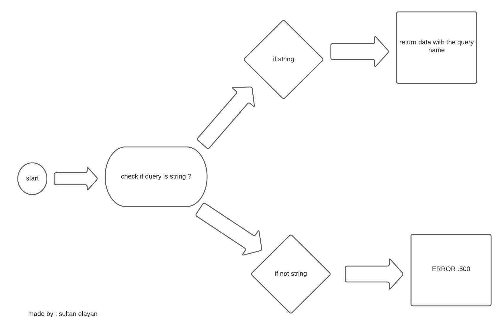

# basic-express-server

## notes 

1. RESTFUL architecture
2. using parameter and body
3. global middleware 
4. CP -r command to copy in terminal 
5. 1st level package and 3rd & local modules
6. making logger and spyOn with mock and getAgent 

## deployment links

- sultan-basic-express-server --> https://sultan-basic-express-server.herokuapp.com/ 
- PR --> https://github.com/sultan-elayan/basic-express-server/pull/3 
- repo action --> https://github.com/sultan-elayan/basic-express-server/runs/3280585811 

## must re-read 

1. mocking 
2. making validator

## MUL 

